# Simple Blog using Laravel

This project is a Blog developed using Laravel and Mysql. It provides functionalities to manage Post and user a ncluding creating, viewing, updating, and deleting Post and user.

## Navigating the Application

        - ** index page**: 
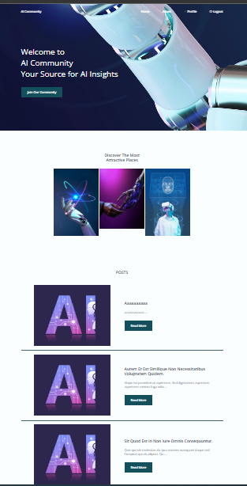

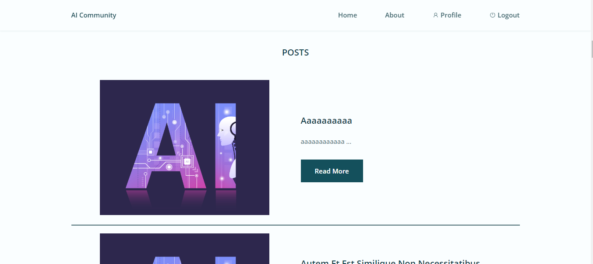
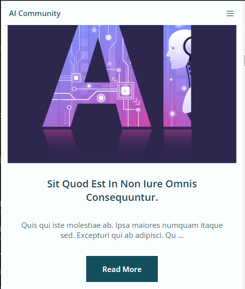
        - **Sing In  and Sing Up**:  
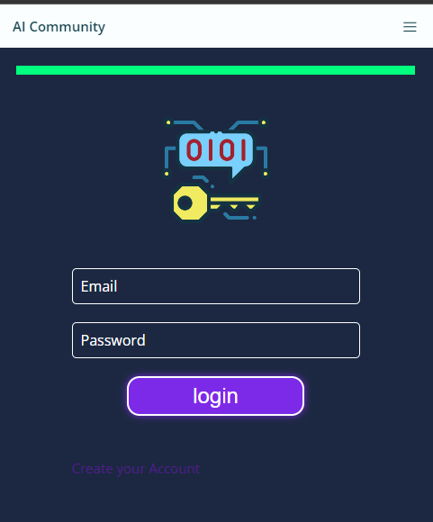
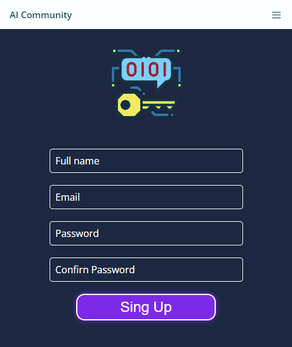
        - **dashboard Admin**:
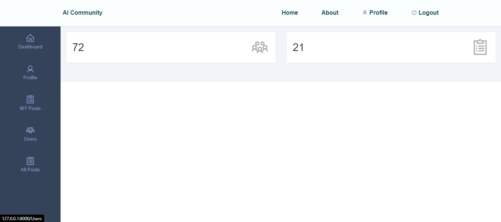
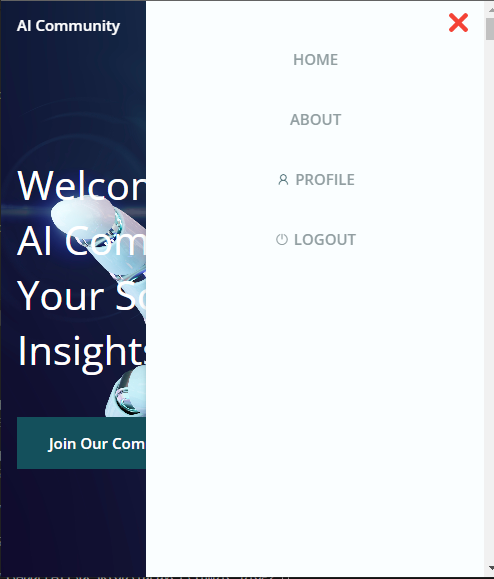
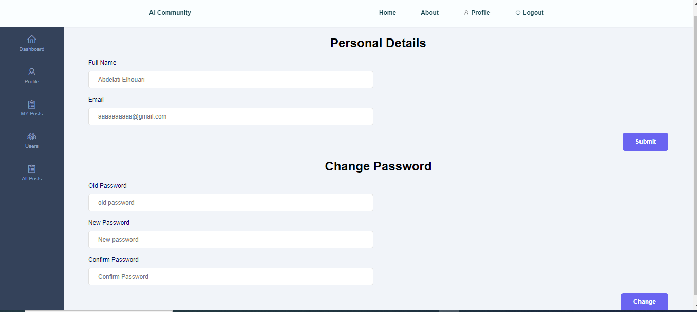
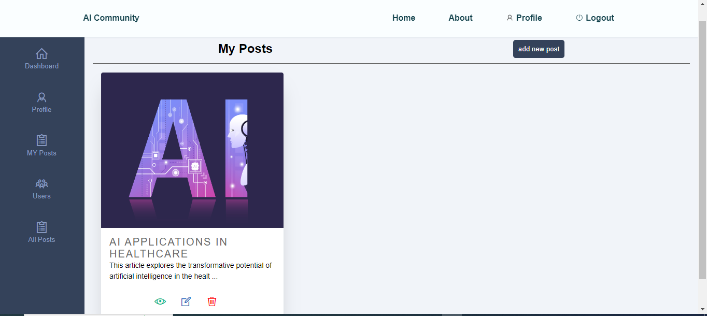

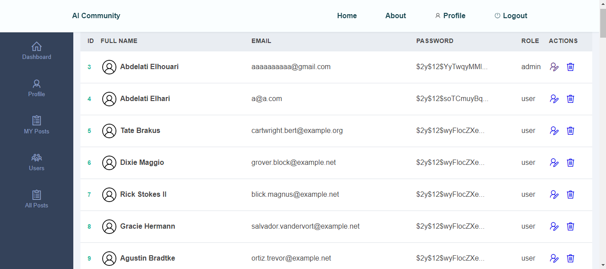
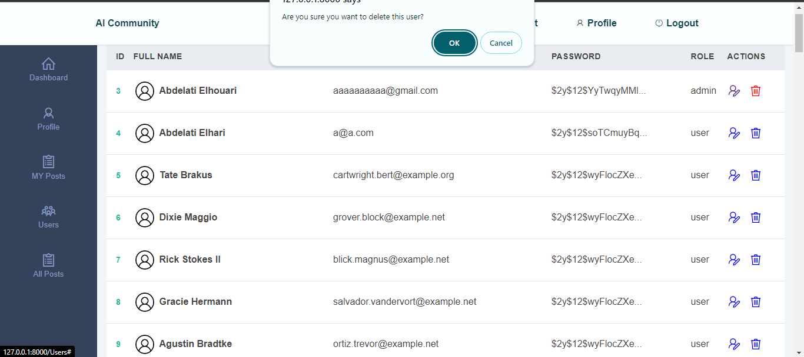
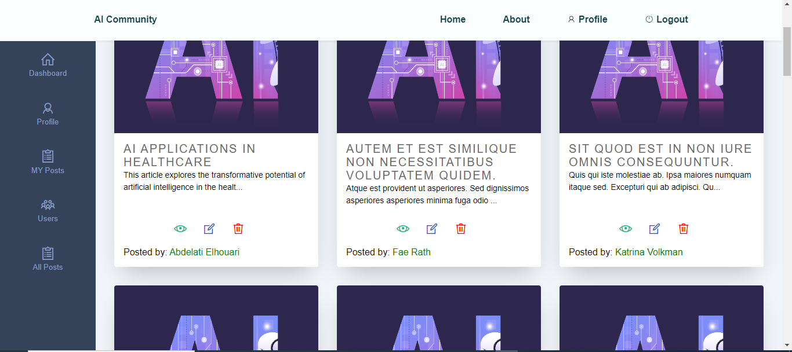
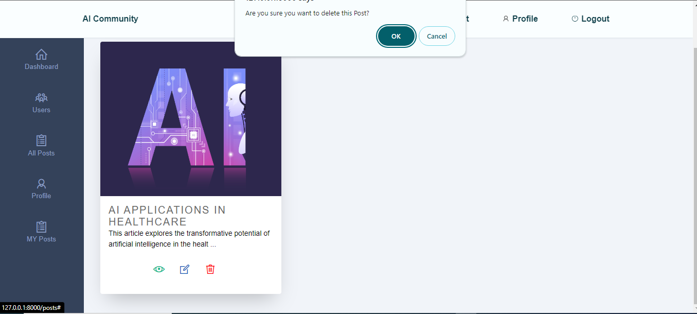
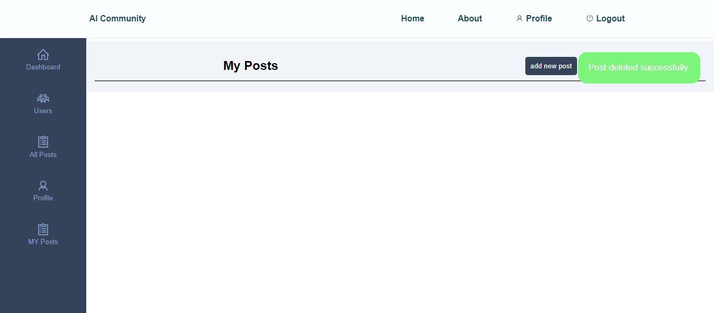
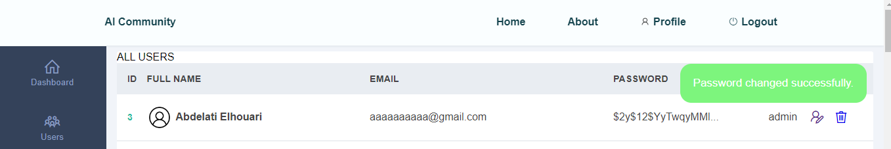
        - **dashboard user**:
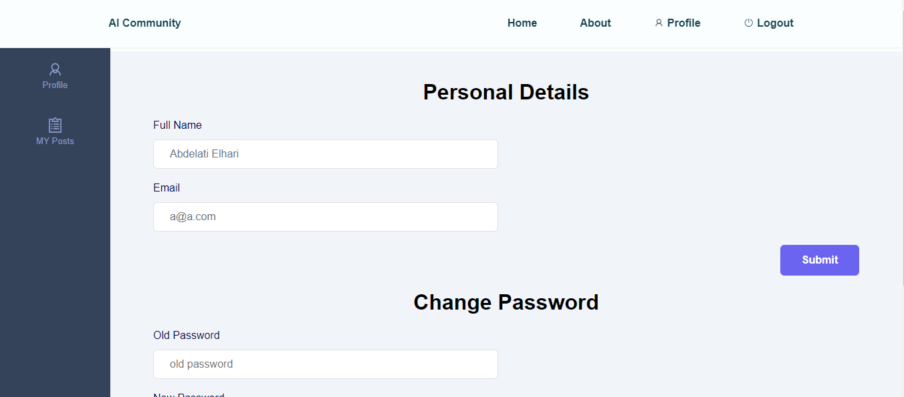

## Setup

To set up and run this project locally, follow these steps:

1. **Clone the Repository**: 
   ```bash
   git clone https://github.com/abdelati-elhouari/Simple_Blog.git

2. **Navigate to the Project Directory**:
    cd Simple_Blog

3. **Install Dependencies:**:
    composer install

4. **Configure Database**:
²²²Update the database configuration in the .env file with your database credentials.

5. **Run Migrations:**:
    php artisan migrate

6. **Start the Development Server**:
    php artisan serve

9. **Access the Application**:
        Open your web browser and navigate to http://localhost:8000.
